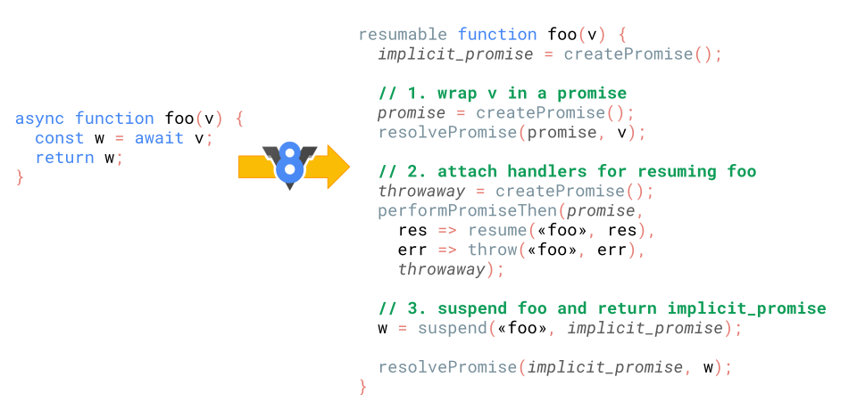

### EventLoop

关于 EventLoop 我看了很多文章，大多讲的比较浅显，我觉得还是不够深入，我决定还是要深入源码和官方文档去理解，
苦于不会找 EventLoop 相关源码，只能看 Node 官网关于 Node 的事件循环的解释，以后找到浏览器相关的事件循环的源码一定补上。

#### 数据结构
- 栈
- 堆
- 队列
 
这块不细说

#### 基本知识

##### 宏任务（macrotask）：

script全部代码、setTimeout、setInterval、setImmediate、I/O、window.postMessage、UI Render

##### 微任务（microtask）：

Promise、process.nextTick、MutationObserver

##### 浏览器 EventLoop 基本流程

1、整段脚本作为一个宏任务执行 

2、执行过程中同步代码执行，宏任务进入宏任务队列，微任务进入微任务队列

3、同步代码执行完毕，检查微任务队列是否为空，不为空则依次从队头取出微任务执行，如果执行过程中
遇到微任务，则放到微任务队列末尾，直到微任务队列为空

4、执行浏览器UI渲染工作

5、检查是否有 web worker 任务，有就执行

6、从宏任务队列取出队首的任务执行，回到2，一直循环，直到宏任务和微任务队列为空

##### 浏览器怎么实现 setTimeout

渲染进程所有运行在主线程上面的任务都要先添加到消息队列，然后事件循环系统根据消息队列的顺序
执行任务。

在 Chrome 中除了消息队列还有一个延迟队列，JavaScript 调用 setTimeout 设置回调函数的时候，
渲染进程会创建一个回调任务，包含了回调函数、延迟执行时间、当前发起时间

```
struct DelayTask{
  int64 id；
  CallBackFunction cbf;
  int start_time;
  int delay_time;
};
DelayTask timerTask;
timerTask.cbf = showName; // 回调函数
timerTask.start_time = getCurrentTime(); //获取当前时间
timerTask.delay_time = 200;//设置延迟执行时间
```

创建好之后，就会把该任务添加到延迟队列中

```
delayed_incoming_queue.push(timerTask)；
```

再来看看消息循环系统怎么触发延迟队列：

```
void ProcessTimerTask(){
  //从delayed_incoming_queue中取出已经到期的定时器任务
  //依次执行这些任务
}

TaskQueue task_queue；
void ProcessTask();
bool keep_running = true;
void MainTherad(){
  for(;;){
    //执行消息队列中的任务
    Task task = task_queue.takeTask();
    ProcessTask(task);
    
    //执行延迟队列中的任务
    ProcessDelayTask()

    if(!keep_running) //如果设置了退出标志，那么直接退出线程循环
        break; 
  }
}
```

处理完一个消息队列的任务后就会执行延迟队列的任务，等到期的任务都执行完之后再继续下一个循环。

**setTimeout 需要注意的一些问题**

1、 当前任务执行太久，会影响是定时器的执行

```javascript
function bar() {
    console.log('bar');
}
function foo() {
    setTimeout(bar, 0);
    for (let i = 0; i < 5000; i++) {
        let k = 5+8+8+8;
        console.log(k);
    }
}
foo();
```

这里设置了 0 毫秒后执行 bar ，但是由于 setTimeout 设置的任务被放在了延迟队列中，而延迟队列
中的任务需要等到当前任务执行完毕后再执行，所以这里会将 for 循环执行完，并判断有没有同步的代码，
再执行 bar ，由于这里循环了 5000 次，执行的时间肯定是超出 0 毫秒的。

2、如果 setTimeout 存在嵌套调用，浏览器会设置最短时间间隔为 4 毫秒

```javascript
function cb() { setTimeout(cb, 0); }
setTimeout(cb, 0);
```

这里设置了 0 毫秒循环调用 cb，看一下 Performance 的记录，前5次调用间隔比较小，嵌套调用5次以上，
后面的时间间隔变成了 4 毫秒。


在 Chrome 中，定时器嵌套调用5次以上，系统会判断该函数被阻塞，如果
设置的时间间隔小于4毫秒，会设置为4毫秒。

```
static const int kMaxTimerNestingLevel = 5;

// Chromium uses a minimum timer interval of 4ms. We'd like to go
// lower; however, there are poorly coded websites out there which do
// create CPU-spinning loops.  Using 4ms prevents the CPU from
// spinning too busily and provides a balance between CPU spinning and
// the smallest possible interval timer.
static constexpr base::TimeDelta kMinimumInterval = base::TimeDelta::FromMilliseconds(4);
```
可以看到源码的注释中写到，有一些代码错误的网站可能会设置了一个 CPU 执行无限循环，设置4毫秒是
为了防止 CPU 一直无限执行循环代码，并在 CPU 循环执行代码和最小间隔定时器之间取得平衡。

因此实时性较高的需求不适用 setTimeout。

3、未激活的页面，setTimeout 最小间隔是 1000 毫秒

```
如果当前不是被激活的标签，定时器最小时间间隔是1000毫秒，目的是为了优化后台加载损耗和减少耗电量
```

4、setTimeout有最大时间间隔限制

```
最大限制为 2147483647 毫秒，原因是Chrome、Safari、Firefox是以32位储存延时值。
如果设置大于 2147483647 毫秒，就会立即执行。
```
```javascript
function showName() { console.log(789); }
console.log(123);
var timerID = setTimeout(showName, 2147483648); //会被理解调用执行
console.log(456);
// 输出结果：
// 123
// 456
// undefined
// 789
```

5、setTimeout 的回调函数中的 this 指向 window 对象，严格模式下为 undefined

```javascript
var name = 1;
var MyObj = {
  name: 2,
  showName: function() {
    console.log(this.name);
  }
};
setTimeout(MyObj.showName, 1000);
// 输出：1
```
解决方法：
```javascript
setTimeout(() => { MyObj.showName(); }, 1000); // 放在匿名函数中执行
```
```javascript
setTimeout(MyObj.showName().bind(MyObj), 1000); // 显式绑定 this
```

##### XMLHttpRequest 怎么工作


XHR 通过 send() 发出请求，浏览器渲染进程会将请求发送给网络进程，网络进程负责资源的下载，等网络进程
收到数据后，会通过 IPC 通知渲染进程，渲染进程把 XHR 设置的回调函数封装成任务，添加到消息队列中，等
到主线程执行到该任务时执行相关的操作。

##### 一些练习题

**练习一**

```html
<div class="outer">
  <div class="inner"></div>
</div>
```

```javascript
var outer = document.querySelector('.outer');
var inner = document.querySelector('.inner');

new MutationObserver(function () {
  console.log('mutate');
}).observe(outer, {
  attributes: true,
});

function onClick() {
  console.log('click');

  setTimeout(function () {
    console.log('timeout');
  }, 0);

  Promise.resolve().then(function () {
    console.log('promise');
  });

  outer.setAttribute('data-random', Math.random());
}

inner.addEventListener('click', onClick);
outer.addEventListener('click', onClick);
```
猜猜以上代码分别点击 outer 和 inner ，分别输出什么？

先来看看点击 outer，结果是什么：

```
click
promise
mutate
timeout
```
```
点击 outer 后，点击事件作为宏任务添加到宏任务队列，并触发回调函数 onClick 然后主线程开始执行 onClick，
一开始输出 click ，setTimeout 加入宏任务队列，Promise then 加入微任务队列，Mutation Observer
加入微任务队列，此时 onClick 函数退出调用栈，进入检查点，执行微任务队列中的任务，依次输出 promise 和 mutate。
最后由于 setTimeout 已到期，执行定时器任务，输出 timeout
```

再来看看点击 inner，结果是什么：

```
click
promise
mutate
click
promise
mutate
timeout
timeout
```

```
点击 inner 后，点击事件作为宏任务添加到宏任务队列，并触发回调函数 onClick 然后主线程开始执行 onClick，
一开始输出 click ，setTimeout 加入宏任务队列，Promise then 加入微任务队列，Mutation Observer
加入微任务队列，此时 onClick 函数退出调用栈，进入检查点，执行微任务队列中的任务，依次输出 promise 和 mutate。
此时 onClick 任务结束，同时发生事件冒泡，outer 的 onClick 函数被推入调用栈，输出 click，setTimeout
添加到宏任务队列，Promise then 添加到微任务队列，Mutation Observer 添加到微任务队列，onClick 已没有
可执行的同步代码，开始执行微任务队列，输出 promise、mutate，此时点击事件任务结束，执行下一个宏任务列表中的任务，
输出 timeout、timeout
```

这里可能会有疑惑，为什么两个 click 会分开输出？而且第一次 click 输出之后就会执行微任务列表中的任务，
而不是冒泡之后再执行？

```
这里的 microtasks 在事件回调之后执行，只要没有其他 JavaScript 在执行。
这是来自 HTML 的规范：
If the stack of script settings objects is now empty，perform a microtask checkpoint。
```
我总结一下就是，该例子中由于第一次触发的 onClick 回调执行完成，当前的执行栈为空，没有其余正在执行的代码
（这是重点），微任务才开始执行，微任务执行完成，由于当前执行的宏任务为点击事件，会触发事件冒泡，于是
outer 的 onClick 被执行。

**练习二**

同样是上述的题目，但是这次不是通过鼠标点击触发，而是通过这句代码触发：`inner.click();`，猜猜结果又是什么。

答案（Chrome 浏览器）：

```
click
click
promise
mutate
promise
timeout
timeout
```

似乎与用户点击输出的结果差别很大，我再来解释一下。这里有个关键点：click() 让 inner 的 onClick 和 outer 的 
onClick 同步触发，所以就会导致 click 先被输出。

这里还有一个注意的地方：mutate 只输出了一次，这里由于第二次触发 mutation 的时候，发现微任务队列已有
mutation 的微任务，就不再添加同样的微任务。

简单总结一下上面两条练习：

- 宏任务按顺序执行，每条宏任务之间可能会执行渲染
- 微任务按顺序执行，在以下情况执行：
  - 每个回调之后，只要没有其他代码在执行
  - 每个宏任务的末尾

##### async、await的执行顺序问题

先看看以下代码。

```javascript
const p = Promise.resolve();
(async () => {
    await p;
    console.log('after:await');
})();
p.then(() => console.log('tick:a'))
 .then(() => console.log('tick:b'));
```

```
Node.js 8 版本
after:await
tick:a
tick:b

Node.js 10 版本
tick:a
tick:b
after:await
```

我们预期是得到上面的结果，但这却是错误的，因为并没有按照规范执行，下面的才是正确的，我们先来看看
以下代码在源码中怎么实现：



1、首先是第一句

```
async function foo(v) {

对应

resumable function foo(v) {
  implicit_promise = createPromise();
``` 

创建了一个隐式 Promise，这是调用 foo 返回的 Promise 。

2、然后是第二句

```
const w = await v;

对应

// 1. 将 v 包装在一个 promise 对象里面
promise = createPromise();
resolvePromise(promise, v);

// 2. 给 Promise 附加处理程序以便稍后恢复异步函数
throwaway = createPromise();
performPromiseThen(promise,
    res => resume(foo, res),
    err => throw(foo, err),
    throwaway);

// 3. 暂停 foo 并返回 implicit_promise
w = suspend(foo, implicit_promise);
```

3、第三句

```
return w;

对应

resolvePromise(implicit_promise, w);
```

这里的关键是第二句：await 的执行。再来拆解一下：

1、创建了 `promise` 对象，这里我们先假设 `v = Promise.resolve(42)` ，这里的 `resolvePromise` 
可以理解为类似 `Promise.resolve()` 的作用

2、创建 `throwaway` 对象，是为了规范存在，为了保证执行的 `promise` 是一个 Promise

3、暂停函数，并返回 `implicit_promise`

换成容易理解的JavaScript代码，类似这样（伪代码）：

```javascript
v = Promise.resolve(42);
var promise = new Promise((resolve, reject) => {
    v.then(res => {
        resolve(res);
    });
});

return implicit_promise = new Promise((resolve, reject) => {
    var throwaway = new Promise((reso, rej) => {
        promise.then(res => {
            reso(res);
        });
    });
   throwaway.then(res => {
       resolve(res);
   });
});
```
通过上述代码可以看到产生了 3 条微任务（观察`then`的数量），分别是`v`, `promise`, `throwaway`，
产生了大量的性能开销。

后来在 Node 12 加入了 `promiseResolve` 函数，并且去掉了 `throwaway`：


下面是`promiseResolve`函数伪代码：
```javascript
function promiseResolve(v) {
    if (v is Promise) return v; // 如果 v 是 Promise，直接返回
    promise = createPromise();
    resolvePromise(promise, v);
    return promise;
}
```

上面模拟的伪代码就可变为：

```javascript
v = Promise.resolve(42);

return implicit_promise = new Promise((resolve, reject) => {
    var promise = new Promise(() => {
        v.then(res => {
            resolve(res);
        });
    });
});
```

最终简化为只创建一条微任务。完结。

参考文档：
- https://tc39.es/ecma262/#sec-newpromisereactionjob
- https://tc39.es/ecma262/#sec-newpromiseresolvethenablejob
- https://tc39.es/ecma262/#sec-performpromisethen

##### Node 中的 Event Loop

正在学习，待补充...


**参考文章：**
- [一次弄懂Event Loop](https://zhuanlan.zhihu.com/p/55511602)
- [如何理解EventLoop——宏任务和微任务篇](http://47.98.159.95/my_blog/js-v8/004.html)
- [前端进阶之道 (EventLoop)](https://yuchengkai.cn/docs/frontend/browser.html#event-loop)
- [Eventloop不可怕，可怕的是遇上Promise](https://juejin.im/post/5c9a43175188252d876e5903)
- [Node 官方文档](https://nodejs.org/zh-cn/docs/guides/event-loop-timers-and-nexttick/)
- https://github.com/tc39/ecma262/pull/1250
- [更快的异步函数和 Promise](https://v8.js.cn/blog/fast-async/)
- [Tasks, microtasks, queues and schedules](https://jakearchibald.com/2015/tasks-microtasks-queues-and-schedules/)
- 掘金《前端面试之道》(付费)
- 极客时间《浏览器工作原理与实践》(付费)